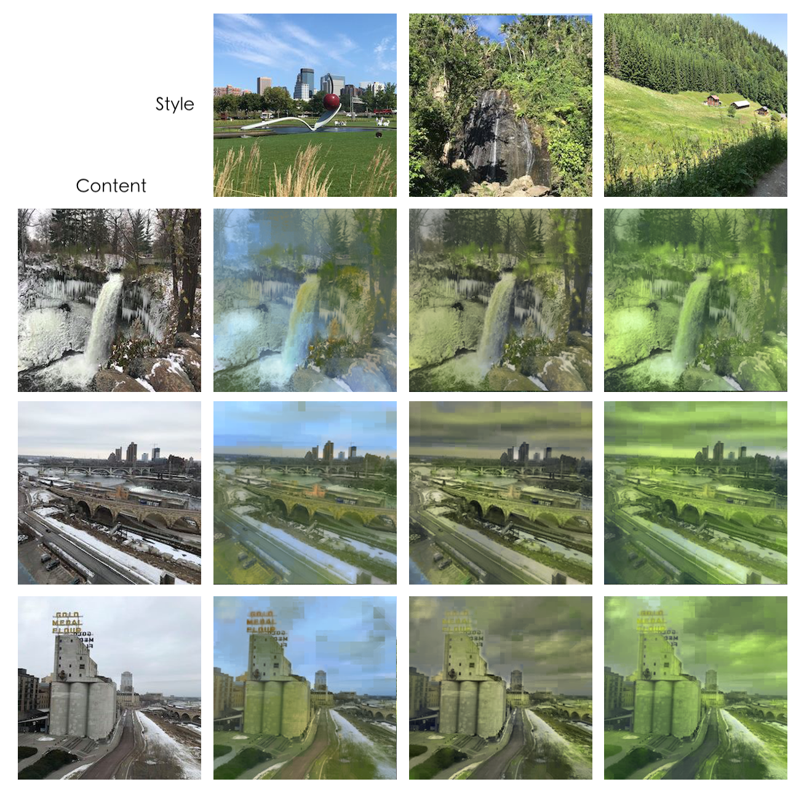

# Computer Vision for Visual Effects Homework 2 
**Team 7**  


## 動機與目的
因為上個作業使用的dataset summer2winter_yosemite在這次也能使用，基於training時間的考量決定延用，還有一個優點是，這樣比較的時候也可以跟上個作業的做法比較。  

## 原本作法：MUNIT

#### 1. Training MUNIT
因為1000000個iteration train不完，所以我們只有train到第59萬個iteration的結果。  

 


#### 2. Inference MUNIT in personal image
由於summer2winter裡的style較為相似，不像edges2shoes/edges2handbags較為多樣，所以隨機產生的十個style裡我挑出了色調或是亮度對比等差距較大的三張作圖比較，儘管看起來相似度還是很高。上面三組是summer to winter，下面三組是winter to summer，最左邊那張是原圖。

  
  


## 我們的做法：FastPhotoStyle

https://github.com/NVIDIA/FastPhotoStyle

### 原理說明
#### 目的

因為那時的style transfer通常限制在顏色與色調轉換，或有風格限制（如季節）；雖然已經有做法能在照片與畫作的轉換上效果很好，但若是兩張真實圖片轉換，就會有很多雜訊痕跡。所以Fast photo style的目的主要是將content image轉換成style image的風格，這兩張都要是真實照片，並且盡量保持content的完整與自然度，希望它轉換後還是能像真正的照片一樣，看起來是用相機照出來的。

#### 作法

將整個流程拆成兩部分 - 風格轉換（stylization）和平滑化（smoothing）。在stylization時，使用有別於一般Whitening and Color Transform（WCT）的特製PhotoWCT，但因為做完PhotoWCT後，會有一些相近的區域卻被不一致的轉換，產生不一樣的style，所以就要使用smoothing處理這些結果。  

整體的公式如下：

  

Content image I_c 跟 Style image I_s先經過F1（PhotoWCT）產生stylization結果Y，然後會將Y與Ic再通過F2（Smoothing），產生最後的照片。

**PhotoWCT**

 

一般的WCT如圖(a)所示。但是因為max-pooling會遺失空間資訊，而upsampling會喪失細節，所以在PhotoWCT裡，它加了max pooling mask跟unpooling，這兩個是一起使用的，目的是記錄max所取的位置做unpool；然後拿掉了upsampling。

**Smoothing**

Smoothing會輸入目標與第一階結果Y，為了讓相似content的pixel該有相似的style，所以它會比較圖中附近pixel的風格，希望這個pixel可以跟鄰居保持一致但是又不能脫離PhotoWCT的結果太多。而為了滿足這兩點，它需要讓以下這個式子越小越好：

  

$y_i$是在F1結果Y裡的pixel顏色，而$r_i$是在F2結果（R）裡我們想要出現的顏色， $\lambda$是控制這兩者間的平衡。$d_{ii}$是W的degree metrix的第[i,i]項（$d_{jj}$同理）。而上面這個式子又可以簡化成以下：

  

$I$是identical matrix， $\alpha = \frac{1}{1+\lambda}$，$S=D^{-\frac{1}{2}}WD^{-\frac{1}{2}}$，是由$I_c$計算而來。$W$也是由$I_c$計算而來，$w_{ij}=e^{-||I_i-I_j||^2/\sigma^2}$，$I_i$、$I_j$分別是鄰近pixel i、j的RGB值，而$\sigma$是一個local window的variance。


### Inference
我們採用FastPhotoStyle的第一種example(without using segmentation mask)，但因為我們電腦安裝的cuda版本與它原本的不同，會出現許多相容性問題，因此決定改成只用CPU mode去執行，而它的code在CPU mode並沒有implement最後post processing的部分，因此我們就捨棄掉post processing的部分。

最後步驟改成以下指令：  

```
python demo.py --output_image_path results/example1.png --no_post  --cuda 0
```

執行結果：  

  

### 結果圖
#### summer to winter
這三種都有呈現出冬天萬物蕭條的感覺。另外，我們可以觀察出三種最右邊的那欄綠色植物的細節被保留最多，尤其是最下面的那列，推測是因為第三種style是唯一一張以自然景物為主的圖(最右邊)，儘管該圖的內容並沒有植物，是瀑布與積雪，但似乎model還是學到了一些自然景物特有的細緻變化，而另外兩欄，分別是橋跟建築物的style就讓model學到了人工的平滑混凝土材質，第二欄(建築物)的第一(山坡)跟第三(樹林)的合成結果可以明顯觀察到和第三欄比起來，植物像是被抹平了。

  

#### winter to summer
由於style transfer會將原本圖片都轉成style圖(夏天綠色景)的風格，因此有很多地方綠的很不自然。我們觀察到style的色彩分佈會顯著影響合成結果。使用山坡圖作為style的第三欄的結果可以觀察到合成結果都被染綠了，而以藍色天空在影像中有最高比例的明尼蘇達大湯匙圖最為style的第一欄是三者中保留最多天空的，但不預期被染綠的人工建物終究還是在合成的結果中變綠了。

 

## 做法成果之分析比較

### summer to winter

  


#### 分析比較:
MUNIT的summer to winter很明顯的是彩度降低，色調上整體變灰變冷。綠色的植被部分，轉換後有很大可能轉換成被積雪覆蓋的感覺，淺藍的天空變成較深的藍。我們觀察到MUNIT輸出的結果中有些非植被部分例如建築與裝置，應該要保持一致的形狀以及較相近的顏色，會被誤認為是別的東西而改變或消失（例如櫻桃）。推測是因為training的過程中使用優勝美地國家公園的影像，其中並沒有人工建物，model很合理地只學到如何轉換自然景物的冬夏景致，並不會轉換不會因季節而有明顯色彩變化的人工造物。

至於FastPhotoStyle的作法相較之下比較不會改動到content裡的結構，所以櫻桃有如預期的被保留下來。這個方法的弱點就是合成結果很受style圖的影像，關於這件事已經在上面討論過了，就不在這裡重述。

最後，上次作業的兩種方法：CycleGAN的合成結果色調偏灰黃，但人工的櫻桃也被一起調成了灰色；而Photoshop法則是用加上飄雪的方式表達出季節是冬天的訊息，但在四種方法中草地是最翠綠的，讓人無法信服這張影像是真的在冬天所拍。

綜上所述，各個方法都有其受限的地方，並沒有哪種方法在任意夏天的圖片轉冬天這個命題下有完美的結果。

### winter to summer


#### 分析比較:
MUNIT的winter to summer中，他學習到夏天的主要特色就是有大量綠色景觀，所以在原圖中有樹或是植被的部分，會被用較綠的質地取代。但圖中不是自然景觀的部分，例如建築、橋或是道路，就沒辦法被正確辨識，做出對應的效果。也就是說，MUNIT的若是在自然景物的影像中可以表現得很好，但影像中有人工造物的話，model還是會使用轉換自然景物的方法轉換該影像，以致於合成出無法令人信服那是夏天的影像。

FastPhotoStyle的話跟summer to winter有同樣的限制：合成結果很受style的選擇。關於此的討論也在上面討論過，不在此贅述。總的來說三張結果都不合理地把影像染綠，無法騙過人眼說這是夏天的影像。

最後，CycleGAN的結果也是有在人工造物的影像中加上綠色，但很有趣地只加在橋上，讓人看起來像是青苔，但昭示著這張影像屬於冬天的岸邊積雪卻原封不動的出現在結果圖上。而Photoshop法在這個本來影像中就沒有飄雪，彩度對比都很高的影像中完全無用武之地，沒什麼好討論的。

總結起來，四種方法中有三種方法有用，而其中CycleGAN生成的結果是三者中最可信的，因為MUNIT的結果讓橋糊掉了、FastPhotoStyle把天空也染綠了。

## 結論

MUNIT的model很受training data的類型影響，這次的情況是我們使用優勝美地國家公園的影像，而影像中天然景色較多，對於橋與建築物等等的辨識度較不佳，因此這個model有很強的專一性，只能處理天然景色的冬夏轉換。FastPhotoStyle主要是在色調上的轉換，他的特色就是對content不會產生變化，所以其實在冬夏轉換上並沒有什麼優勢。


