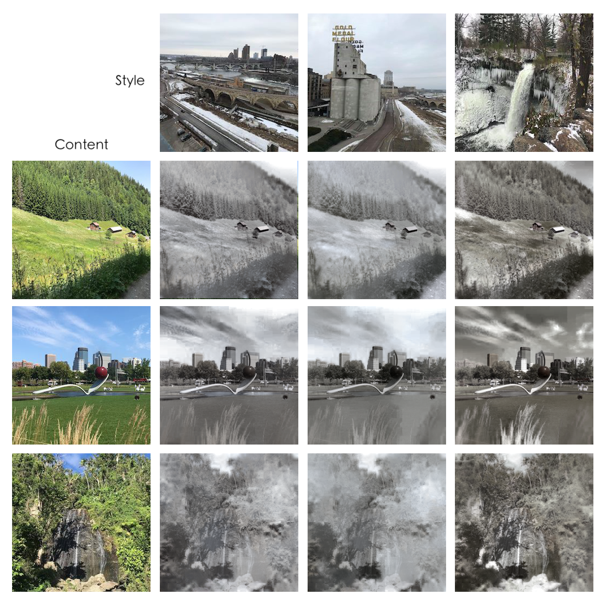

# Computer Vision for Visual Effects Homework 2 
**Team 7**  


## 動機與目的
因為上個作業使用的dataset summer2winter_yosemite在這次也能使用，基於training時間的考量決定延用，還有一個優點是，這樣比較的時候也可以跟上個作業的做法比較。  

## 原本作法：MUNIT

#### 1. Training MUNIT
因為1000000個iteration train不完，所以我們只有train到第59萬個iteration的結果。  

 


#### 2. Inference MUNIT in personal image
由於summer2winter裡的style較為相似，不像edges2shoes/edges2handbags較為多樣，所以隨機產生的十個style裡我挑出了色調或是亮度對比等差距較大的三張作圖比較，儘管看起來相似度還是很高。

  
  


## 我們的做法：FastPhotoStyle

我們採用FastPhotoStyle的第一種example(without using segmentation mask)，但因為我們電腦安裝的cuda版本與它原本的不同，會出現許多相容性問題，因此決定改成只用CPU mode去執行，而它的code在CPU mode並沒有implement最後post processing的部分，因此我們就捨棄掉post processing的部分。

```
最後步驟改成以下指令
python demo.py --output_image_path results/example1.png --no_post   --cuda 0
```
執行結果:


### 結果圖
#### summer to winter
這三種都有呈現出冬天萬物蕭條的感覺。

  

#### winter to summer
由於style transfer會將原本圖片都轉成style圖(夏天綠色景)的風格，因此有很多地方綠的很不自然

 

## 做法成果之分析比較

### summer to winter

  


#### 分析比較:
MUNIT的summer to winter很明顯的是彩度降低，色調上整體變灰變冷。綠色的植被部分，轉換後有很大可能轉換成被積雪覆蓋的感覺，淺藍的天空變成較深的藍。缺點是有些非植被部分例如建築與裝置，應該要保持一致的形狀以及較相近的顏色，會被誤認為是別的東西而改變或消失（例如櫻桃）。

### winter to summer


#### 分析比較:
MUNIT的winter to summer中，他學習到夏天的主要特色就是有大量綠色景觀，所以在原圖中有樹或是植被的部分，會被用較綠的質地取代。但圖中不是自然景觀的部分，例如建築、橋或是道路，就沒辦法被正確辨識，做出對應的效果。

## 結論
優勝美地的天然景色較多，對於橋與建築物等等的辨識度較不佳，表示這個dataset比較有專一性。


