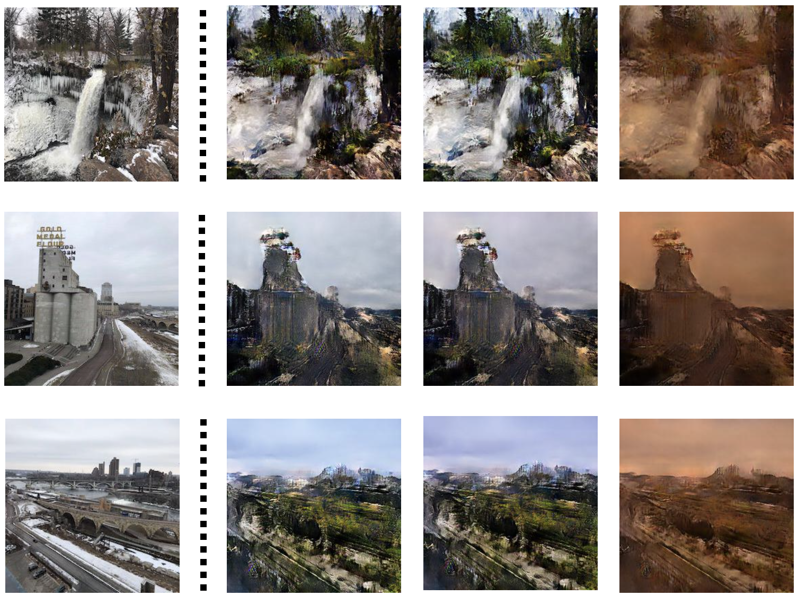

# Computer Vision for Visual Effects Homework 2 
**Team 7**  

## 動機與目的
因為上個作業使用的dataset summer2winter_yosemite在這次也能使用，基於training時間的考量決定延用，還有一個優點是，這樣比較的時候也可以跟上個作業的做法比較。  

## 原本作法：MUNIT

#### 1. Training MUNIT
因為1000000個iteration train不完，所以我們只有train到第59萬個iteration的結果。  

 

#### 2. Inference MUNIT in personal image
由於summer2winter裡的style較為相似，不像edges2shoes/edges2handbags較為多樣，所以隨機產生的十個style裡我挑出了色調或是亮度對比等差距較大的三張作圖比較，儘管看起來相似度還是很高。上面三組是summer to winter，下面三組是winter to summer，最左邊那張是原圖。

  
  

## 我們的做法：FastPhotoStyle
目的：將content image轉換成style image的風格，並且盡量保持content的完整與自然度，希望它能像真正的照片一樣，看起來是用相機照出來的。
困境：過去的轉換通常限制在顏色與色調轉換，或有風格限制（如季節）。Gatys等人的方法在照片與畫作的轉換上效果很好，但在兩張真實圖片裡，會有很多加工的雜訊痕跡。
作法：stylization - 使用Whitening and Color Transform，根據特徵投影產生style。WCT是為人工的風格轉換設計，所以會有加工的雜訊痕跡。解法：用novel network design。但可能會產生部分不一致的style，解法：smoothing。
     smoothing   - manifoid ranking algorithm。F1：Stylization transform，但會產生不一致的加工痕跡，所以需要F2：smoothing function。
     => F2(F1(Ic, Is), Ic) c:content, s:style
WCT: key idea:用兩個映射來把style feature對應到content上。給Ic, Is，提取Ic->Hc，Is->Hs，
PhotoWCT: 因為max-pooling會遺失空間資訊，而且upsampling會喪失細節=>+max pooling mask, -upsampling, + unpooling

## 做法成果之分析比較

### summer to winter

#### 分析比較:
MUNIT的summer to winter很明顯的是彩度降低，色調上整體變灰變冷。綠色的植被部分，轉換後有很大可能轉換成被積雪覆蓋的感覺，淺藍的天空變成較深的藍。缺點是有些非植被部分例如建築與裝置，應該要保持一致的形狀以及較相近的顏色，會被誤認為是別的東西而改變或消失（例如櫻桃）。

### winter to summer

#### 分析比較:
MUNIT的winter to summer中，他學習到夏天的主要特色就是有大量綠色景觀，所以在原圖中有樹或是植被的部分，會被用較綠的質地取代。但圖中不是自然景觀的部分，例如建築、橋或是道路，就沒辦法被正確辨識，做出對應的效果。

## 結論
優勝美地的天然景色較多，對於橋與建築物等等的辨識度較不佳，表示這個dataset比較有專一性。

